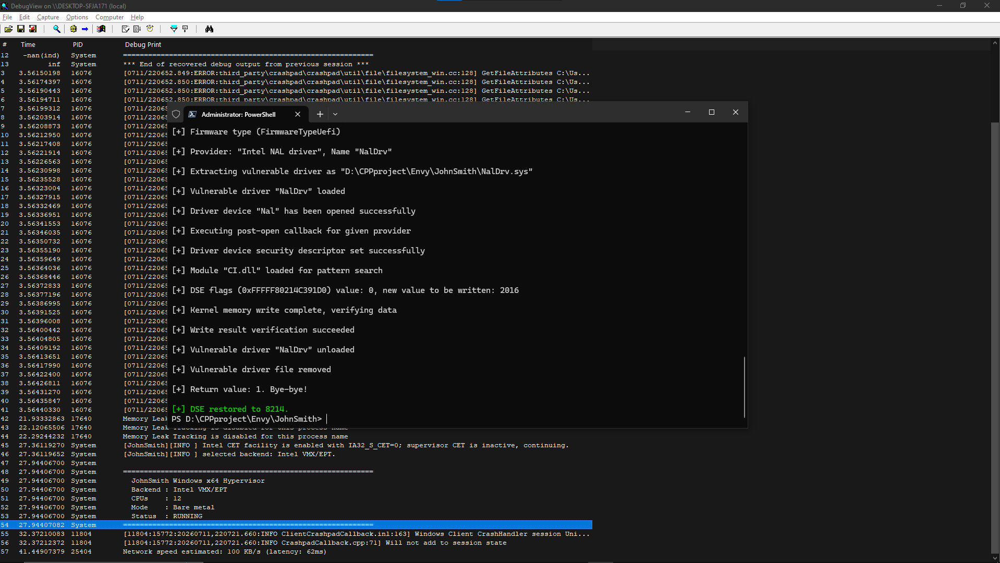

# JohnSmith documentation

Primary-source policy for architecture work. Snapshot: **2026-07-11**.

## Rules

- Use Intel SDM, AMD APM, Microsoft Learn, and installed WDK headers as
  authority. Samples, blogs, and Hypervisor Project Refference are discovery only.
- Cite document ID/revision plus section or table title. Page numbers move.
- Add `C_ASSERT` for layouts and runtime checks for optional CPU features.
- A clean build is not hardware proof. Do not claim runtime safety without
  debugger-backed Intel and AMD bare-metal results.
- Physical RAM discovery uses `MmGetPhysicalMemoryRangesEx2`; the supported
  OS floor is Windows 10 version 2004.

## Code map

- `include/`: stable common, vendor, and assembly-facing contracts.
- `src/hv.c`: backend selection and synchronized all-CPU lifecycle.
- `src/intel.c`, `src/amd.c`: capability, resource, start/stop, and ops wiring.
- `src/intel/`: private VMCS, EPT, and VM-exit modules.
- `src/amd/`: private VMCB, NPT, and VM-exit modules.
- `src/introspection.c`, `src/log.c`: owned-page policy and passive-level logs.

## Sources

| Area | Primary source |
| --- | --- |
| Intel VMX/EPT | [Intel SDM version 092](https://www.intel.com/content/www/us/en/developer/articles/technical/intel-sdm.html) and [Intel map](static/docs/intel-vmx.md) |
| AMD SVM/NPT | [AMD APM 24593 rev. 3.44](https://docs.amd.com/v/u/en-US/24593_3.44_APM_Vol2), [instruction volume 24594 rev. 3.37](https://docs.amd.com/v/u/en-US/24594_3.37), and [AMD map](static/docs/amd-svm.md) |
| Windows kernel | [Driver DDI reference](https://learn.microsoft.com/en-us/windows-hardware/drivers/ddi/) |
| Assembly ABI | [Microsoft x64 calling convention](https://learn.microsoft.com/en-us/cpp/build/x64-calling-convention?view=msvc-170) |
